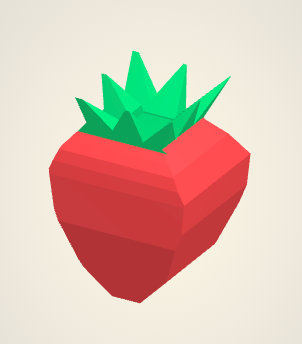

```
A breakthrough CAD software on your browser
```

Chokoku CAD can create complex shapes with few and simple controls.

https://ittakun.sakura.ne.jp/chokokucad/

 

## How to use Chokoku tool
### Make path
Click the screen to create the path.
Click start point to close.

### Editing path
Select the edit icon and move the segments.

### Shave model
Select the path add icon and click OK button or press Enter key.

### Lock
Maybe you want to create a shape with holes like a cup.
To do so, select the lock icon, and the Chokoku tool will not shave off the area selected by the path.

## Credits
- THREE.js (https://github.com/mrdoob/three.js)
- paper.js (https://github.com/paperjs/paper.js)
- ThreeBSP (https://github.com/sshirokov/ThreeBSP)
